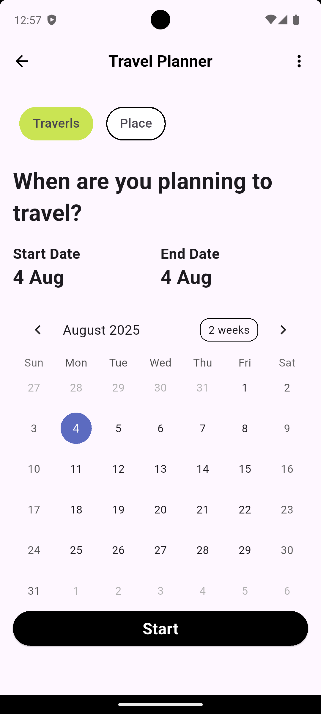
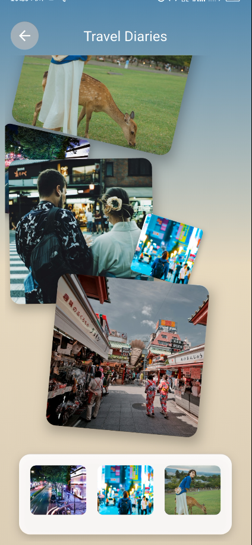

# 🧳 Travel Diaries

Travel Diaries is a creative Flutter-based mobile application that allows users to record, organize, and relive their travel memories in a visual, interactive, scrapbook-style interface. Drag and drop images, rotate them, and stack memories like a physical journal — all within a smooth and artistic layout.

---

## ✨ Features

- 🖼️ Drag-and-drop photo memory interface
- 🔄 Randomized angle and position for scrapbook effect
- 🎨 Stack and overlay memories organically
- 🧭 Smooth UI with custom AppBar and gradient background
- 🗂️ Fully offline experience using local assets (WebP supported)
- 📦 Support for high-quality `.webp` images to reduce app size
- 📱 Optimized for both Android and iOS

---

## 🎥 Demo

### 📸 Screenshots

|Home | Event |
|-----------------|----------------|
|  |  |

|Dairy | Dairy |
|-----------------|----------------|
|  |  |


<!-- ### 🎬 Video Walkthrough

https://user-images.githubusercontent.com/your-username/your-demo-video.mp4 -->


---

## 🚀 Installation

### Prerequisites

- Flutter 3.x
- Dart SDK
- Android Studio or Xcode (for platform builds)

### Steps

```bash
git clone https://github.com/yourusername/travel_diaries.git
cd travel_diaries
flutter pub get
flutter run
